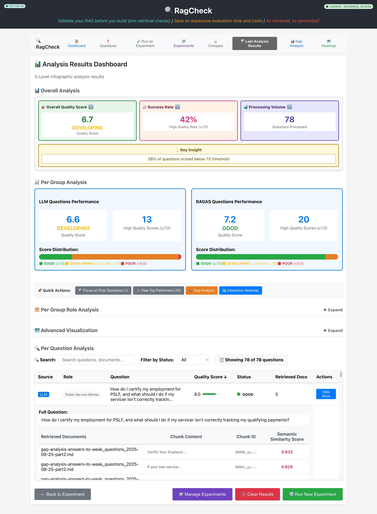
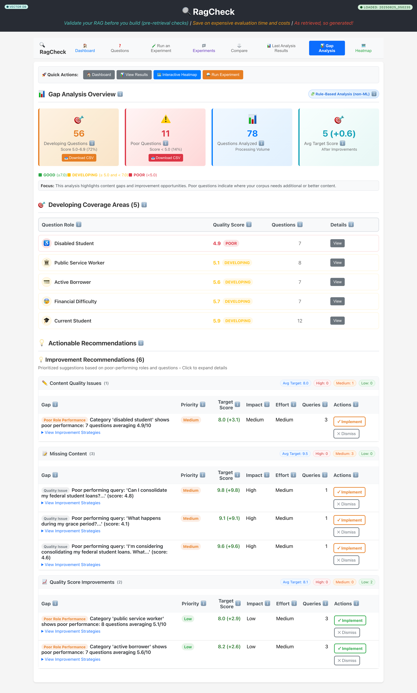
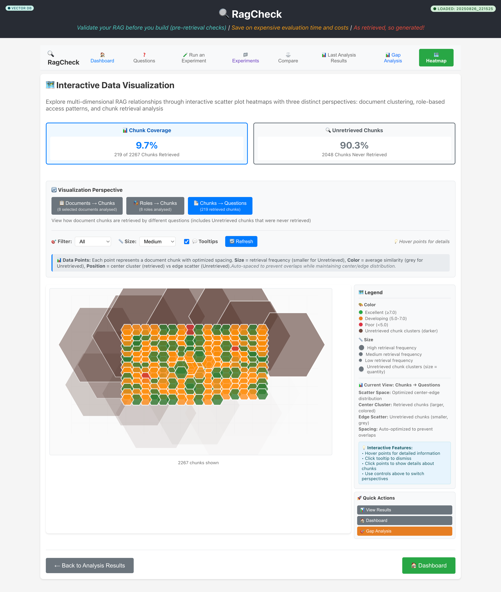

# RagCheck

A 6-screen wizard application for comprehensive RAG system quality assessment using client-provided/approved queries (with support for AI-generated and RAGAS-generated questions when necessary) with real document processing, vector similarity search, advanced gap analysis, and interactive data visualization.

## Visuals


|:  :|:  :|
|:----:|:----:|

|:  :|
|:----:|

## 🚀 Quick Start (Docker - Recommended)

```bash
# 1. Set up environment
cp .env.example .env  # Add your OPENAI_API_KEY

# 2. Start all services with one command
./start-services.sh
```

**Services:**
- Frontend: http://localhost:3000
- Backend API: http://localhost:8000  
- Qdrant Database: http://localhost:6333

### Alternative Startup Options

**Service Management:**
```bash
./start-services.sh               # Start all services (recommended)
./stop-services.sh                # Stop all services interactively
./scripts/health-check.sh         # Monitor service health
```

**Individual Services** (advanced):
```bash
docker-compose up qdrant          # Just vector database
docker-compose up backend         # Backend + Qdrant (auto-starts)
docker-compose up frontend        # Full stack (auto-starts all)
```

### Manual Setup (Fallback)
```bash
# If Docker isn't available (versions auto-switch: Python 3.12.2, Node.js v22.16.0)
./setup.sh --manual
```

## Documentation

| Documentation | Description |
|---------------|-------------|
| 🏗️ [Architecture](docs/architecture.md) | Technical architecture and system design |
| ⭐ [Features](docs/features.md) | Complete feature overview and capabilities |
| 🔌 [API Reference](docs/api.md) | REST endpoints, WebSocket API, and technologies |
| 🚀 [Cloud Deployment](docs/deployment.md) | Vercel, Railway deployment guides |
| 🔧 [Troubleshooting](docs/troubleshooting.md) | Common issues and debugging tips |

## Prerequisites

### Docker Setup (Recommended)
1. **Docker & Docker Compose** - For containerized environment
2. **OpenAI API Key** - Document embeddings ([Get API key](https://platform.openai.com/api-keys))
3. **Data Files** - CSV/PDF files in `./backend/data/`

### Manual Setup (Fallback)
1. **Docker & Docker Compose** - Qdrant vector database only
2. **Python 3.12+ & Node.js 22+** - Auto-managed via pyenv/nvm
3. **OpenAI API Key** - Document embeddings
4. **Data Files** - CSV/PDF files in `./backend/data/`

## Key Features

- **🎯 6-Screen Wizard**: Dashboard → Questions → Experiment → Results → Gap Analysis → Heatmap
- **⚙️ Advanced Experiments**: Comprehensive experiment tracking with timing data, metadata, and chronological ordering
- **📊 Quality Metrics Focus**: Centralized quality score system replacing business impact with consistent 0-10 scale thresholds
- **🔄 Dynamic Comparisons**: Real-time comparison comments and enhanced experiment analytics
- **📊 Advanced Gap Analysis**: Domain-agnostic intelligent content gap detection with practical improvement strategies
- **💡 Smart Recommendations**: Non-ML rule-based engine with priority scoring and impact assessment
- **🗺️ Interactive Visualizations**: D3.js hexagonal heatmaps with multi-perspective analytics (Documents→Chunks, Roles→Chunks) and smart collision detection
- **📈 Real-time Analytics**: Coverage statistics, unretrieved chunk detection, performance insights
- **🗃️ Vector Storage**: Persistent Qdrant database with similarity search and real-time connectivity checks
- **📡 Live Updates**: WebSocket streaming for experiment progress with comprehensive error handling
- **⏱️ Experiment Timing**: Real-time timing display and comprehensive reproducibility metadata
- **💬 Custom Tooltips**: Consistent balloon tooltips with smart positioning and cursor indicators
- **⚡ Performance Optimized**: Advanced caching, D3.js rendering optimization, and state management
- **🔧 Database Integration**: Real-time chunk counting and connectivity status with fallback handling

### Frontend Shared Modules

- **Shared Utilities** (`frontend/src/utils/`)
  - `qualityScore.ts`: Centralized quality score calculations and threshold logic
  - `constants.ts`: Shared constants for quality score thresholds, colors, and categorization
  - `heatmapData.ts`: Data processing utilities for multiple visualization perspectives
- **Heatmap Utilities** (`frontend/src/components/heatmap/*`)
  - `heatmapTheme.ts`: Centralized quality score scale, colors, thresholds, legend labels  
  - `ScatterHeatmap.tsx`: Generic hex-grid renderer using shared layout and theme utilities
  - `HeatmapControls.tsx`, `HeatmapLegend.tsx`, `HeatmapTooltip.tsx`: Reusable controls, legends, and smart tooltips
- **Navigation Helper** (`frontend/src/hooks/usePageNavigation.ts`)
  - `goTo(path, label?, context?)`, `replace(path, label?, context?)`, `back(context?)`
  - Automatically logs navigation via `utils/logger.ts` with component, action, and context
  - Consistent navigation patterns across all pages with proper logging
- **Gap Analysis Components** (`frontend/src/components/gap-analysis/*`)
  - `GapAnalysisDashboard.tsx`: Main container with comprehensive gap insights
  - `GapAnalysisOverview.tsx`: Interactive statistics cards with visual indicators
  - `DevelopingCoverageAreas.tsx`: Topic-based gap visualization with expandable details for developing coverage areas
  - `RecommendationCards.tsx`: Prioritized actionable recommendations with implementation tracking

## Components

### Backend (FastAPI)
- **Document Processing**: CSV/PDF loading with LangChain chunking and configurable strategies
- **Vector Operations**: Qdrant database integration with OpenAI embeddings and connectivity monitoring
- **Gap Analysis Engine**: Non-ML rule-based content gap detection with sophisticated priority scoring algorithms
- **Service Architecture**: Manager pattern with QualityScoreService, ExperimentService, GapAnalysisService, and ErrorResponseService
- **Performance Caching**: Search result caching (5min TTL) with MD5-based query keys and LRU eviction
- **Real-time Streaming**: WebSocket experiment progress updates with error handling
- **Comprehensive Logging**: User-friendly logging with development/production modes

### Frontend (Next.js)
- **TypeScript Application**: Type-safe React components and API integration with comprehensive interfaces
- **Interactive Visualizations**: D3.js hexagonal scatter plots with optimized data binding patterns
- **Performance Optimization**: API request caching (10min TTL), React state management, and rendering improvements
- **UI/UX Enhancement**: Custom BalloonTooltip components with smart positioning and consistent styling
- **Responsive Design**: Mobile-friendly CSS Grid and Flexbox layouts with enhanced visual indicators
- **Cross-platform Storage**: Adapters for local development and cloud deployment with auto-save functionality

## 🐛 Troubleshooting

### Service Issues
```bash
# Check service health
./scripts/health-check.sh

# Stop and restart services
./stop-services.sh
./start-services.sh

# View container logs  
docker-compose logs backend
docker-compose logs frontend
docker-compose logs qdrant
```

### Port Conflicts
```bash
# Check what's using ports
sudo lsof -i :3000
sudo lsof -i :8000  
sudo lsof -i :6333

# Kill conflicting processes
sudo lsof -ti:3000 | xargs kill -9
```

### Environment Issues
```bash
# Verify OpenAI API key is set
grep OPENAI_API_KEY .env

# Check Docker container environment
docker-compose exec backend env | grep OPENAI
```

## Contributing

Contributions are welcome! Please feel free to submit a pull request.

## License

This project is licensed under the MIT License. See the [LICENSE](LICENSE) file for details.